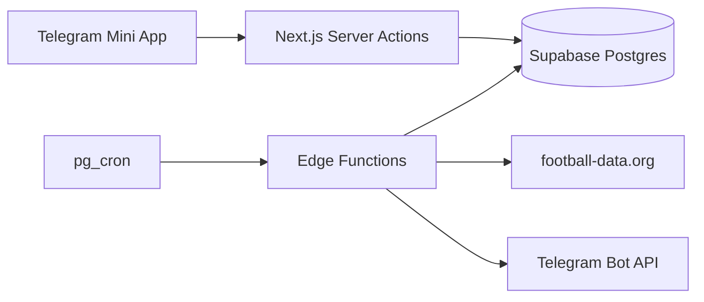

# WC 2026 Predictor

Telegram Mini App для прогнозов на исходы матчей чемпионата мира 2026.


## Возможности

### Прогнозы и матчи

- Прогноз исхода матча: победа хозяев / ничья / победа гостей (в плей-офф ничья недоступна)
- Шифрование прогнозов до раскрытия (AES-256-GCM)
- Раскрытие чужих picks: через 3+ минут live или после завершения матча
- Live-счёт, минута матча, события (голы, карточки), составы на поле
- Live-проекция очков по текущему счёту
- Групповые таблицы и сетка плей-офф (оверлей с knockout-колонками)
- Детали матча: прогнозы, статистика, составы, таймлайн событий
- Realtime-обновления через Supabase

### Тай-брейк

- 4 раунда: Matchday 1–3 + Playoffs
- Прогноз суммарных голов (0–300) через wheel picker
- Дедлайны и блокировка после дедлайна
- Таблица отклонений от фактических голов; влияет на ранжирование в лидерборде

### Лидерборд

- Вкладки: общий рейтинг, по стадиям, график позиций (recharts)
- Учёт tie-breaker deviation при ранжировании
- Realtime-обновление

### Пользователи и роли

| Роль | Возможности |
|------|-------------|
| `guest` | Просмотр матчей и лидерборда (без имён участников), без голосования |
| `participant` | Прогнозы до kickoff, tie-breaker, полный лидерборд |
| `admin` | Управление участниками, Telegram ping, назначение ролей |

### Прочее

- i18n: английский, русский, польский (`next-intl`)
- Telegram-уведомления: напоминания о прогнозе (за 6 ч до матча), push о голах
- Настройки: display name, аватар, язык, уведомления о голах
- Админка: одобрение участников, список pending picks, массовый ping

## Стек

| Слой | Технологии |
|------|------------|
| Frontend | Next.js 16 (App Router), React 19, TypeScript, Tailwind 4, shadcn/ui |
| Backend | Supabase — Postgres, Auth, RLS, Edge Functions, Realtime |
| Auth | Telegram Mini App `initData` → server action → Supabase session |
| i18n | next-intl |
| Deploy | Vercel |

**Внешние API:** OpenFootball (расписание), football-data.org (live-данные), Wikipedia (составы), Telegram Bot API.

## Архитектура



Проект организован по [Feature-Sliced Design](https://feature-sliced.design/):

```
src/
  app/          # Next.js App Router (страницы, layouts)
  features/     # auth, matches, predictions, admin, leaderboard, ...
  entities/     # match, prediction, tiebreaker, leaderboard
  shared/       # lib, ui, types
  components/ui # shadcn components
```

## Система очков

Прогноз: выбор исхода (`home` / `draw` / `away`). За правильный прогноз начисляются очки в зависимости от раунда:

| `round_key` | Раунд | Очки |
|-------------|-------|------|
| `group_1`, `group_2`, `group_3` | Групповой этап | 1 |
| `round_of_32` | 1/16 финала | 2 |
| `round_of_16` | 1/8 финала | 3 |
| `quarter_final` | 1/4 финала | 4 |
| `semi_final` | 1/2 финала | 5 |
| `final` | Финал | 6 |
| `third_place` | Матч за 3-е место | 0 |

**Плей-офф:** исход определяется по полю `winner` (учёт пенальти), а не по счёту основного времени. Если `winner` ещё не синхронизирован — очки не начисляются.

**Tie-breaker:** отдельная система — прогноз суммарных голов по турам, ранжирование по отклонению от факта.

Подробнее: [docs/scoring.md](docs/scoring.md).

## Быстрый старт

### 1. Supabase

1. Создайте проект в Supabase (или используйте существующий)
2. Скопируйте `.env.example` → `.env.local` и заполните ключи
3. Примените миграции из `supabase/migrations/` (001–019) через SQL Editor или `supabase db push`
4. Импортируйте данные:

```bash
pnpm import:schedule
pnpm import:squads
```

### 2. Telegram Bot

1. Создайте бота через [@BotFather](https://t.me/BotFather)
2. Настройте Mini App URL (Vercel или локальный tunnel)
3. Добавьте `TELEGRAM_BOT_TOKEN` и `TELEGRAM_AUTH_PEPPER` в `.env.local`

### 3. Первый админ

После первого входа через Telegram:

```sql
update public.profiles set role = 'admin' where telegram_id = YOUR_TELEGRAM_ID;
```

### 4. Локальный запуск

```bash
pnpm install
pnpm setup:hosts      # один раз: sudo, добавляет 127.0.0.1 wcbot.localhost в /etc/hosts
pnpm setup:https      # один раз: доверить CA + HTTPS proxy на :1355
pnpm fix:cert         # если браузер ругается на сертификат — пересоздать TLS для wcbot
pnpm dev              # https://wcbot.localhost:1355
```

**Важно:** без записи в `/etc/hosts` браузер идёт по IPv6 (`::1`) и HTTPS не открывается.

**Telegram Mini App (локально):** в BotFather укажите `https://wcbot.localhost:1355`.

Если proxy не запущен: `pnpm proxy:start:https`.

## Скрипты

| Команда | Описание |
|---------|----------|
| `pnpm dev` | Dev-сервер через portless → `https://wcbot.localhost:1355` |
| `pnpm dev:plain` | `next dev` без portless |
| `pnpm proxy:start` | Portless proxy на :1355 (HTTP) |
| `pnpm proxy:start:https` | Portless proxy на :1355 (HTTPS) |
| `pnpm proxy:stop` | Остановка proxy |
| `pnpm setup:hosts` | Добавляет `127.0.0.1 wcbot.localhost` в `/etc/hosts` |
| `pnpm setup:https` | `portless trust` + HTTPS proxy |
| `pnpm setup:dev` | `setup:hosts` + `setup:https` |
| `pnpm fix:cert` | Пересоздаёт TLS-сертификат portless |
| `pnpm build` | Production build |
| `pnpm start` | Production server |
| `pnpm lint` | ESLint |
| `pnpm format` | Prettier |
| `pnpm typecheck` | `tsc --noEmit` |
| `pnpm test` | Unit-тесты (Vitest) |
| `pnpm test:watch` | Vitest в watch-режиме |
| `pnpm import:schedule` | Импорт расписания из OpenFootball |
| `pnpm import:squads` | Импорт составов из Wikipedia |
| `pnpm copy:player-photos` | Копирование фото игроков из другого Supabase |
| `pnpm map:fd` | Сопоставление матчей с football-data.org |
| `pnpm extract:team-colors` | Извлечение цветов команд из флагов |
| `pnpm encrypt:predictions` | Миграция: шифрование plain-text прогнозов |
| `pnpm award:points` | Ручной пересчёт `points_awarded` |

## Edge Functions

| Функция | Назначение | Cron |
|---------|------------|------|
| `sync-schedule` | Обновление расписания из OpenFootball | каждые 10 мин |
| `sync-live-matches` | Live-данные с football-data.org, начисление очков | каждые 20 сек |
| `send-prediction-reminders` | Telegram-напоминания за 6 ч до матча | каждые 10 мин |
| `send-goal-notifications` | Push о голах участникам с `notify_goals=true` | каждые 30 сек |

Деплой и настройка секретов: [docs/deployment.md](docs/deployment.md).

## Документация

- [Архитектура](docs/architecture.md)
- [Модель данных](docs/data-model.md)
- [Роли и RLS](docs/roles-and-rls.md)
- [Telegram Auth](docs/telegram-auth.md)
- [Система очков](docs/scoring.md)
- [Деплой](docs/deployment.md)

## Деплой

- **Frontend:** Vercel (`pnpm build`)
- **Backend:** Supabase (миграции, Edge Functions, pg_cron, Vault secrets)

Подробная инструкция: [docs/deployment.md](docs/deployment.md).

## Лицензия

[MIT](LICENSE)
