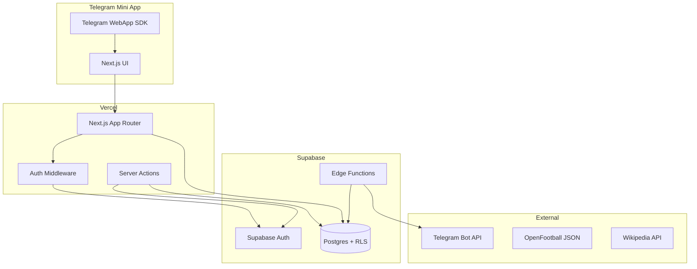

# Архитектура

## Обзор

## Слои приложения

| Слой | Назначение |
|------|------------|
| `app/` | Маршруты, layouts, страницы |
| `features/` | Бизнес-логика по фичам (auth, matches, admin) |
| `entities/` | Доменные типы и утилиты |
| `shared/` | Переиспользуемые UI, Supabase-клиенты, типы |
| `components/ui/` | shadcn/ui примитивы |

## Поток аутентификации

1. Пользователь открывает Mini App в Telegram
2. `Telegram.WebApp.initData` передаётся в server action
3. `@tma.js/init-data-node` валидирует подпись bot token
4. Server action создаёт/обновляет Supabase user и сессию
5. Middleware обновляет cookies на каждом запросе

## Edge Functions (зарезервировано)

- Уведомления через Telegram Bot API
- Пересчёт очков по расписанию (cron)
- Webhook-обработчики бота
