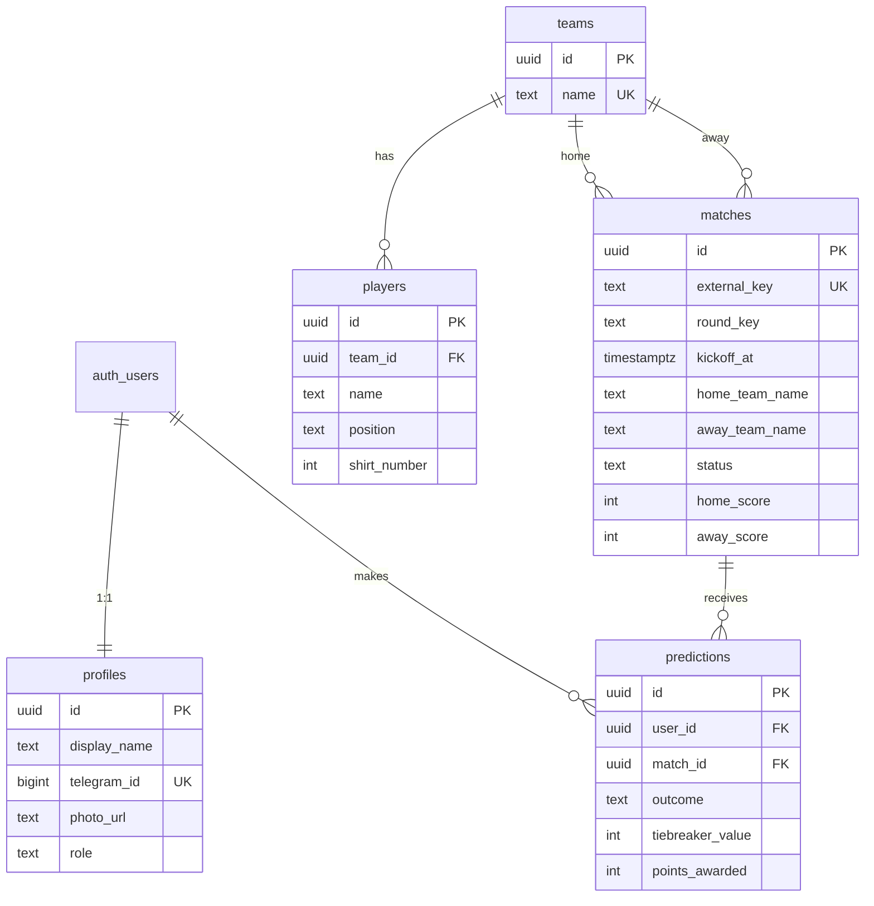

# Модель данных

## ER-диаграмма



## Таблицы

### profiles

Профиль пользователя, связанный с `auth.users`. Роль по умолчанию — `guest`.

### teams / matches / players

Данные ЧМ-2026: команды, расписание (OpenFootball), составы (Wikipedia).

### predictions

Прогноз участника на матч:

- `outcome`: `home` | `draw` | `away`
- `tiebreaker_value`: целое число (логика TBD)
- `points_awarded`: начисленные очки (заполняется после матча)

### leaderboard_base (view)

Агрегация: `total_points`, `predictions_count` для участников.

## Импорт данных

```bash
pnpm import:schedule  # → teams, matches
pnpm import:squads    # → players (требует teams)
```
