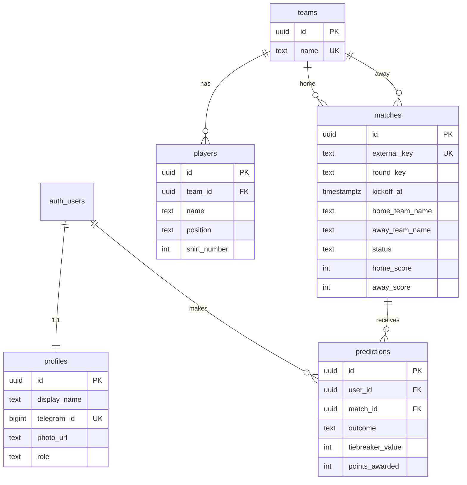

# Модель данных

## ER-диаграмма


```mermaid
erDiagram
  auth_users ||--|| profiles : "1:1"
  teams ||--o{ players : has
  teams ||--o{ matches : home
  teams ||--o{ matches : away
  auth_users ||--o{ predictions : makes
  matches ||--o{ predictions : receives

  profiles {
    uuid id PK
    text display_name
    bigint telegram_id UK
    text photo_url
    text role
  }

  teams {
    uuid id PK
    text name UK
  }

  matches {
    uuid id PK
    text external_key UK
    text round_key
    timestamptz kickoff_at
    text home_team_name
    text away_team_name
    text status
    int home_score
    int away_score
  }

  players {
    uuid id PK
    uuid team_id FK
    text name
    text position
    int shirt_number
  }

  predictions {
    uuid id PK
    uuid user_id FK
    uuid match_id FK
    text outcome
    int tiebreaker_value
    int points_awarded
  }
```

## Таблицы

### profiles

Профиль пользователя, связанный с `auth.users`. Роль по умолчанию — `guest`.

### teams / matches / players

Данные ЧМ-2026: команды, расписание (OpenFootball), составы (Wikipedia).

#### Жизненный цикл матча

1. **Первичный импорт** — `pnpm import:schedule` создаёт строки в `matches` со статусом `scheduled`. В плей-офф команды могут быть плейсхолдерами (`1F`, `W74`, `3A/B/C/D/F`): имена хранятся в `home_team_name` / `away_team_name`, `home_team_id` / `away_team_id` = `null`.
2. **Обновление расписания** — edge function `sync-schedule` (pg_cron каждые 10 мин) повторно тянет OpenFootball и обновляет команды, время и площадку. Счёт, статус, `fd_match_id` и составы **не трогаются**.
3. **Live-синхронизация** — edge function `sync-live-matches` (pg_cron каждые 20 с) подтягивает счёт и статус с football-data.org. Сопоставление идёт по именам команд, поэтому плей-офф начинает синхронизироваться после того, как `sync-schedule` подставит реальные названия.

### predictions

Прогноз участника на матч:

- `outcome`: `home` | `draw` | `away`
- `tiebreaker_value`: целое число (логика TBD)
- `points_awarded`: начисленные очки (заполняется после матча)

### leaderboard_base (view)

Агрегация: `total_points`, `predictions_count` для участников.

## Импорт данных

```bash
pnpm import:schedule  # → teams, matches
pnpm import:squads    # → players (требует teams)
```
