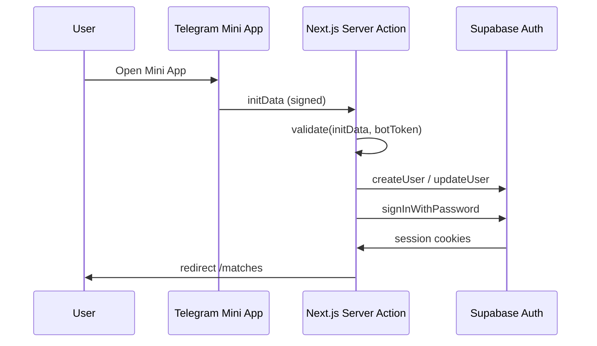

# Telegram Authentication

## Поток

## Переменные окружения

| Переменная | Где | Описание |
|------------|-----|----------|
| `TELEGRAM_BOT_TOKEN` | server only | Токен от @BotFather |
| `TELEGRAM_AUTH_PEPPER` | server only | Секрет для HMAC-пароля (`openssl rand -hex 32`) |
| `DEV_TELEGRAM_ID` | server only | Dev bypass вне Telegram |

## Реализация

- `src/features/auth/actions.ts` — `signInWithTelegram`, `signInWithDevBypass`
- `src/features/auth/ui/TelegramLogin.tsx` — клиентский auto-login
- `src/shared/lib/supabase/middleware.ts` — защита маршрутов

## Dev bypass

В `NODE_ENV=development` при открытии вне Telegram используется `signInWithDevBypass()` с `DEV_TELEGRAM_ID`.

## Безопасность

- Bot token никогда не попадает в клиент
- Пароль Supabase детерминирован: `HMAC-SHA256(telegram_id, pepper)`
- initData валидируется с `expiresIn: 3600`
